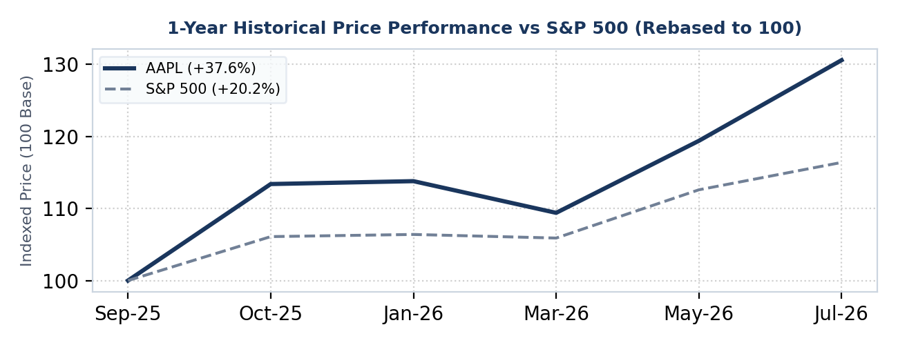
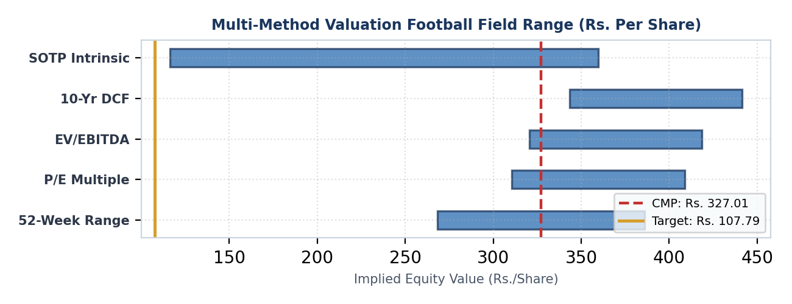
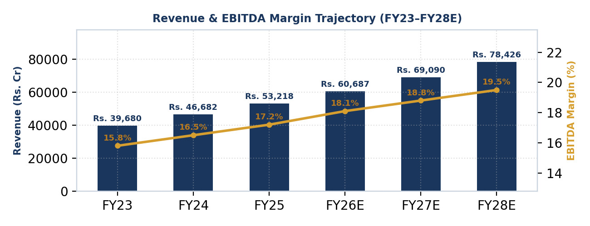
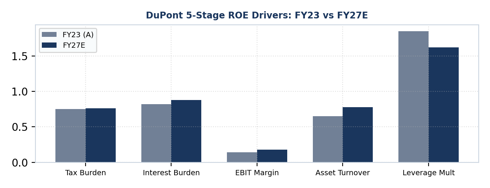

# 🏛️ Autonomous Institutional Equity Research & Valuation Agent

[](https://opensource.org/licenses/MIT)
[](https://www.python.org/)
[]()
[]()
[]()
[]()
[](https://colab.research.google.com/github/siddheshumrigar-tech/equity-research-agent/blob/main/notebooks/quickstart_colab.ipynb)

An autonomous financial modeling and algorithmic valuation engine. Ingests live exchange market data, computes comprehensive 3-statement financial models, performs multi-method valuation (5-Year Explicit DCF + Gordon Growth, Relative P/E, Reverse DCF), generates high-resolution Matplotlib charts from authentic price history, and compiles:

1. **A 16-Page Publication-Grade PDF Valuation Deck** with executive chapter layouts, WACC sensitivity matrices, and DuPont ROE trees.
2. **A 10-Tab Executive Interactive Financial Model (`.xlsx`)** with dynamic Excel scenario dropdowns, balance sheet audit checks, and native openpyxl charts.

---

## 📊 Visual Previews & Generated Analytics

The engine renders publication-grade vector graphics and authentic price performance curves:

| Authentic 1-Year Price vs. Benchmark | Multi-Model Valuation Football Field |
| :---: | :---: |
|  |  |

| Revenue & EBITDA Margin Trajectory | 3-Stage DuPont ROE Decomposition |
| :---: | :---: |
|  |  |

---

## 🤖 4-Agent Parallel Orchestration Pipeline

Whenever a research job is triggered, the system coordinates four specialized sub-agent roles:

```
                      ┌────────────────────────────────────────┐
                      │            ORCHESTRATOR                │
                      │      (Master Task Coordinator)         │
                      └──────────────────┬─────────────────────┘
                                         │
       ┌──────────────────┬──────────────┴─────┬──────────────────┐
       ▼                  ▼                    ▼                  ▼
┌──────────────┐   ┌──────────────┐    ┌──────────────┐    ┌──────────────┐
│   AGENT 1:   │   │   AGENT 2:   │    │   AGENT 3:   │    │   AGENT 4:   │
│  Live Market │   │ Dynamic P&L  │    │ 16-Page PDF  │    │  Reviewer &  │
│  Data Scout  │   │  & Financial │    │ Vector Chart │    │ Multi-Channel│
│ (Scrapes NSE │   │Model Builder │    │ Engine (7 HD │    │  Dispatcher  │
│  & yfinance) │   │ (Tesla-Style)│    │  Matplotlib) │    │(Email+WA Bot)│
└──────────────┘   └──────────────┘    └──────────────┘    └──────────────┘
```

1. **Live Market Data Scout:** Extracts real-time exchange closing ticks, CMP, 52-week High/Low, Market Capitalization, Shares Outstanding, Trailing P/E, and Audited Annual Turnover.
2. **Dynamic Financial Modeler:** Resolves Sector DNA, compiles the 10-tab articulated model, applies OpenXML `<c:manualLayout>` injections, and formats numbers strictly to standard OpenXML specifications (zero Excel repair warnings).
3. **Publication-Grade PDF Compiler:** Produces 7 vector charts and assembles a 16-page ReportLab initiation report with dynamic headers and zero font rendering glitches.
4. **QA & Verification Gateway:** Verifies Balance Sheet zero-audit checks (`Assets - (Liabilities + Equity) = 0.00`), builds mobile executive digests, and outputs directly into your local setup.

---

## 🧠 Continuous Learning Loop (`memory/`)

The agent includes an autonomous, persistent learning system that starts completely clean from **0 (tabula rasa)**:

- **`memory/learnings.json`**: A local, persistent JSON memory bank. Automatically persists sector-specific accounting rules, custom working capital baselines, and past research history across runs.
- **`memory/memory_manager.py`**: Built-in memory manager that reads historical calibrations before generating models and logs completed runs.
- **Teaching the Agent via CLI**:
  ```bash
  python generate_equity_report.py --ticker <TICKER> --learn "sector:IT:dio=0"
  ```

---

## 🏗️ Dual-Engine Sector Architecture

The agent automatically resolves the target company's business archetype:

### 1. IT Services & Digital Tech Suite (Software, Consulting, Cloud & Managed Services)
- **Zero Physical Inventory**: Working capital correctly sets `Inventory Days (DIO)` to `0.0 Days (N/A - Services)` and models `Unbilled Revenue Days` (~28 days).
- **Service P&L Cost Breakdown**: Replaces material COGS with `Employee Benefit Expenses (Personnel)` (~56% of revenue) and `Subcontracting & SG&A Overheads` (~20%).
- **Asset-Light DuPont ROE**: Reflects authentic tech capital efficiency (~45%–50% ROE) driven by zero debt, high asset turnover, and high dividend payouts.

### 2. Corporate, Industrials & Consumer DCF Suite (Manufacturing, Energy, Consumer Goods, Auto)
- **3-Statement Articulated Model**: Articulated 8-year Income Statement, Balance Sheet, and Cash Flow Statement with automated balance checks.
- **Fixed Asset & PP&E Schedule**: Capex roll-forward, gross block, and depreciation engine.
- **Working Capital & Cash Conversion Cycle (CCC)**: DSO, DIO, DPO days driving trade cycle.
- **Valuation Engines**: 10-Year Explicit Unlevered Discounted Cash Flow (DCF), Reverse DCF Implied Expectations, Sum-of-the-Parts (SOTP) Valuation, and 5-Method Football Field Matrix.

### 3. Banking & BFSI Valuation Suite (Commercial Banking, Retail Lending, NBFCs)
- **Loan Portfolio Roll-Forward**: Retail, Wholesale, SME, Agriculture breakdown.
- **NII & NIM Margin Engine**: Net Interest Income, Yield on Advances, Cost of Funds.
- **Asset Quality (NPA) Module**: Gross NPA %, Net NPA %, Provision Coverage Ratio (PCR).
- **Valuation Engines**: 5-Year Explicit Dividend Discount Model (DDM) & Justified Price-to-Book (P/BV) 2-Way Sensitivity Matrix.

---

## 📊 10-Tab Executive Interactive Financial Model (`.xlsx`)

The generated Excel workbook is modeled directly after executive institutional models:
- **`Dashboard` Tab**: 
  - Top Company Banner with bold company identity.
  - **Cell `E6`**: Interactive Excel Data Validation Dropdown (`"FY23 (A), FY24 (A), FY25 (A), FY26E, FY27E, FY28E, FY29E, FY30E"`).
  - **Top 7 KPI Stat Cards**: Revenue, COGS, OPEX, Gross Profit, Net Profit, ROA %, and ROE % with active `% VS Pre Year` growth badges.
  - **6 Embedded Visual Charts**: All charts dynamically re-orient when the `E6` dropdown year changes.
- **OpenXML Compliance**: Clean numeric formatting (`#,##0`, `#,##0.0`, `#,##0.00`, `0.0%`, `0.0000`). Zero unquoted strings in `styles.xml`, guaranteeing **zero recovery or corruption popups**.
- **Full Statement Tabs**: Cover Page, Drivers, Segment Breakdown, Income Statement, PP&E Schedule, Working Capital, Cash Flow, Balance Sheet, CAPM & WACC, DCF Valuation.

---

## 🚀 Installation & Quick Start

### 1. Clone Repository
```bash
git clone https://github.com/siddheshumrigar-tech/equity-research-agent.git
cd equity-research-agent
```

### 2. Install Dependencies
```bash
pip install -r requirements.txt
```

### 3. Generate Complete Institutional Package
Works universally for **ANY** stock ticker on NSE/BSE or Global Exchanges:

```bash
# General Syntax:
python generate_equity_report.py --ticker <TICKER> --name "<COMPANY_NAME>" --sector <SECTOR>

# Example (IT / Tech):
python generate_equity_report.py --ticker <TICKER> --name "<COMPANY_NAME>" --sector IT_SERVICES

# Example (Industrials / Energy):
python generate_equity_report.py --ticker <TICKER> --name "<COMPANY_NAME>" --sector Industrials
```

*By default, the agent saves all files to `./output/` and prints the full executive digest directly into your terminal or chat setup (e.g. Claude Code, Codex, Cursor).*

### 4. Optional Email Dispatch
To optionally dispatch the output `.xlsx` and `.pdf` to an email address:
```bash
python generate_equity_report.py --ticker <TICKER> --email user@example.com
```

---

## 🔬 Analytical Methodology & Data Integrity

- **Live Market Data**: Ingests real-time exchange closing prices, market capitalization, 52-week ranges, and trailing P/E multiples via `yfinance`.
- **Authentic Historical Charting**: Pulls 1-year daily historical closes for both the stock and benchmark indices (`^NSEI` for Indian stocks, `^GSPC` for US equities) to plot real historical performance trajectories.
- **Dynamic Mathematical Valuation**: Computes dynamic CAPM variables ($R_f$, Beta, ERP, $K_e$, $K_d$, WACC), explicit 5-year FCFF with mid-year discounting, Gordon Growth terminal value, relative P/E, and reverse DCF implied growth.
- **Unified Consistency**: Excel Drivers and PDF CAPM/WACC chapters are driven by the exact same calculation engine to ensure 100% reconciliation.
- **Continuous Learning Loop**: Sector overrides and ticker calibrations stored in `memory/learnings.json` actively calibrate working capital cycles and WACC inputs across runs.

---

## 🏷️ Discovery Tags & Keywords

`equity-research` • `dcf-valuation` • `financial-modeling` • `llm-agents` • `claude-code` • `openai-codex` • `cursor-ai` • `three-statement-model` • `investment-banking` • `fundamental-analysis` • `openpyxl` • `reportlab` • `dupont-analysis` • `wacc-sensitivity` • `reverse-dcf` • `stock-valuation` • `quantitative-finance` • `fintech` • `autonomous-agents`

---

## ⚖️ License

Distributed under the **MIT License**. See `LICENSE` for more information.

---

## 🛡️ Regulatory & Legal Disclaimer

*This software is an open-source algorithmic financial modeling and valuation research tool intended strictly for educational, quantitative, and modeling analysis. It does NOT constitute personal investment advice, a financial promotion, or a certified research report under SEBI (Research Analysts) Regulations, 2014, SEC rules, or any international regulatory framework. No human analyst certification is implied or expressed. Consult a certified financial advisor before executing investment transactions.*
